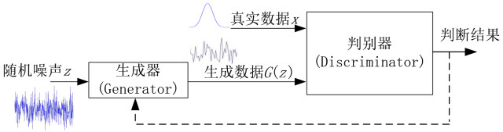
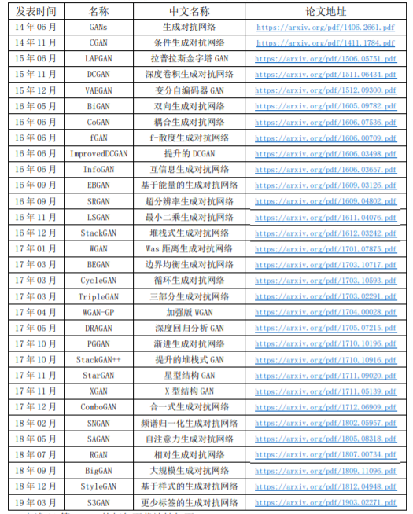
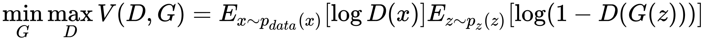
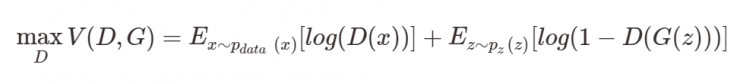
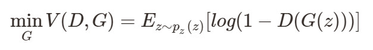
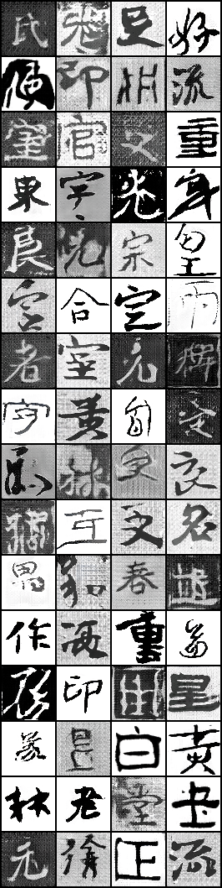
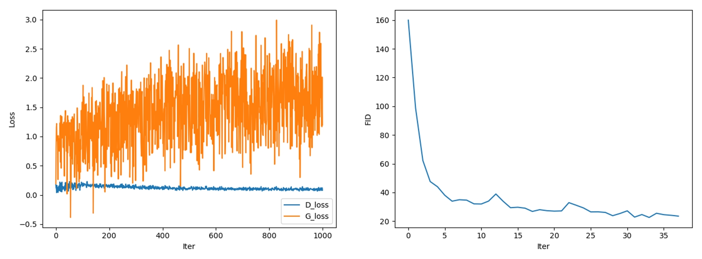

# GAN on Chinese Calligraphy Fonts

[TOC]

## Basic knowledge

> **说明：**因为网上已经有许多优秀的理论介绍文档，想系统学习的可以直接跳到本文的**References**部分，本文仅从实践角度对必要理论进行总结。

### 1. 生成对抗

下图很好地说明了生成对抗模型的思想，其实就是生成器与判别器之间的相互博弈，最终使得生成器学习到真实数据的分布特征，达到 ”以假乱真“ 的效果。

### 2. 生成模型和判别模型

生成模型和判别模型的设计无疑是最关键的部分。区别在于生成器需要学习真是样本的所有特征，而判别器只需要学习到两者的不同特征即可。但往往的做法是将两种网络设计成对称的结构，如GAN, DCGAN等。下面是某博主按顺序总结的2014~2019.3之间的所有论文，详见Reference. 1。

### 3. 目标函数

由于生成对抗模型本质上还是两个神经网络，需要进行反向传播来更新权重，因此需要设计目标函数。GAN原文给出的目标函数如下：

其中，Pdata(x) 为真样本的分布，Pz(z) 为假样本的分布，E 为期望。这里其实是两个网络损失函数的组合，分开看就好：

优化 D，即优化判别网络时，没有生成网络什么事，x 为真样本，后面的 G(z) 就相当于已经得到的假样本，因此这里就相当于一个**二分类**的交叉熵损失函数。优化 D 的公式的第一项，使得真样本 x 输入的时候，得到的结果越大越好，因为真样本的预测结果越接近1越好；对于假样本G(z)，需要优化的是其结果越小越好，也就是D(G(z)) 越小越好，因为它的标签为 0。但是第一项越大，第二项越小，就矛盾了，所以把第二项改为 1-D(G(z))，这样就越大越好。

优化G，只与第二项有关，这个时候希望假样本的标签是 1，所以是 D(G(z))越大越好，但是为了统一成 1-D(G(z))的形式，那么只能是最小化 1-D(G(z))，本质上没有区别，只是为了形式的统一。之后这两个优化模型可以合并起来写，就变成最开始的最大最小目标函数了。事实上，生成器的目标函数等价于优化真样本分布和假样本分布之间的 **JS 散度**，即分布的相似性（有兴趣可以自己查）。

需要注意的是，实际训练时，采用交替训练，即先训练D，后训练G，不断重复。因此，对于生成器，其最小化的是—判别器目标函数的最大值。

实际上，衡量两个分布之间距离的方式有很多种，后来的学者通过定义不同的度量方式，提出了LSGAN，EBGAN等模型来改进GAN训练的稳定性。

### 4. 训练效果评价

前面说到，训练过程中会产生两个变化相反的loss曲线，因此无法根据loss的变化来判断模型的训练效果。除了用肉眼进行粗略判断外，常见的有Inception Score，FID等。详见Reference 2.

### 5. 模型介绍

Gan好是好，但训练难，主要体现在：1）模式坍塌，即最后生成的对象就只有少数几个模式；2）不收敛，在训练过程中，Discriminator很早就进入了理想状态，总能perfectly分辨出真假，因此无法给Generator提供梯度信息，而导致训练无法进行下去。

**WGAN** 针对此问题，提出了一种新的loss：Wasserstein Distance，可以消除传统Gan训练时出现的收敛问题，使训练过程变得稳定。具体策略是，即Discriminator的参数矩阵需要满足Lipschitz约束，但其方法比较简单粗暴：直接对参数矩阵中元素进行限制，不让其大于某个值。这种方法，是可以保证Lipschitz约束的，但在削顶的同时，也破坏了整个参数矩阵的结构——各参数之间的比例关系。

针对这个问题，**SNGAN **提出了一个既满足Lipschitz条件，又不用破坏矩阵结构的方法Spectral Normalization。只需让每层网络的网络参数除以该层参数矩阵的谱范数即可满足Lipschitz=1的约束。另外，以实际生成来讲，**SNGAN**也是目前唯一一个能够只用一对生成器和鉴别器就能从 ImageNet 数据集生成具有不错质量图像的方法（当然是与在此之前的方法相比，不讲BigGAN）。

论文中的实验结果表明，**SNGAN**生成的图像更清晰、更丰富，训练时间也更短。

### 6. References

1. [Blog:【学习笔记】生成模型——生成对抗网络](http://www.gwylab.com/note-gans.html)

2. [Blog: GAN万字长文综述(郭晓锋)](https://blog.csdn.net/c9Yv2cf9I06K2A9E/article/details/88684919)

3. [Blog: 谱归一化（Spectral Normalization）的理解](https://blog.csdn.net/StreamRock/article/details/83590347)

4. [Github: DeepLearning-500-questions](https://github.com/scutan90/DeepLearning-500-questions/tree/master/ch07_%E7%94%9F%E6%88%90%E5%AF%B9%E6%8A%97%E7%BD%91%E7%BB%9C(GAN))

5. [Paper: How Generative Adversarial Networks and its variants Work: An Overview of GAN](https://arxiv.org/pdf/1711.05914.pdf)

## Example work: GAN on Chinese Calligraphy Fonts

介绍完理论，本节介绍一下最近的工作：利用GAN生成中国书法汉字。下图是利用条件SNGAN生成的结果。（左：生成图；中：过程图；右：原图）

​                            

训练过程：

虽然SNGAN训练过程很稳定，但是在训练其他GAN的过程中可能会用到一下的tricks:

1. 训练之前：
    - G的输入用高斯分布采样，不用均匀分布采样；
    - 一般采用 lrD (5e-5) 比 lrG (2e-5) 小，参考BigGAN；
    - 好用的模型：DCGAN，DRAGAN，WGAN-GP，SNGAN等；
    - 如果有标签，尽量采用cGAN；
2. 训练之后：
    - 训练崩溃，即D很快收敛，G较大 —> 增大lrG，减小lrD；
    - 输入图片尺寸较大（128x128）生成图片分辨率低时，考虑使用SELU替代BN+ReLU；
    - 模型完成的标志：某一方loss收敛。

### Acknowledgements

1. SNGAN <https://github.com/crcrpar/pytorch.sngan_projection>

